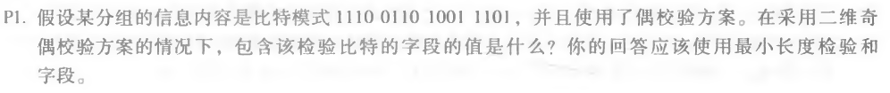
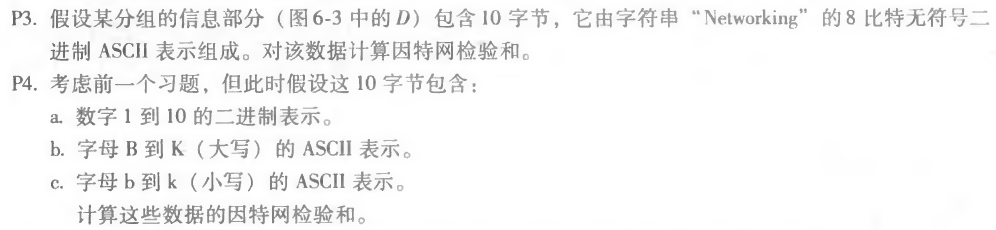

### 第十一次作业

* * *

#### P1

##### 题目：


##### 作答：
包含该检验比特的字段的值如下：

1 1 1 0 1 

0 1 1 0 0 

1 0 0 1 0 

1 1 0 1 1 

1 1 0 0 0 

* * *

#### P3+P4

##### 题目：


##### 作答：
P3. 将16位的值加起来：
```
  01001100 01101001 
+ 01101110 01101011 
+ 00100000 01001100 
+ 01100001 01111001
+ 01100101 01110010 
------------------------------ 
  10100010 00001100 
```

可以得到检验和为：01011101 11110011 

与上述方法同理：

P4.a. 检验和为：11100110 11100001 

P4.b. 检验和为：01100000 01011011 

P4.c. 检验和为：11111111 11111010 

* * *
