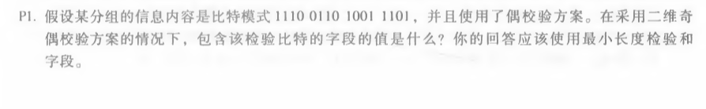

# 网络及分布式计算第十一次作业

#### 2017302580018  刘佳媚

---

### 1、P1

解：

| 1    | 1    | 1    | 0    | 1    |
| ---- | ---- | ---- | ---- | ---- |
| 0    | 1    | 1    | 0    | 0    |
| 1    | 0    | 0    | 1    | 0    |
| 1    | 1    | 0    | 1    | 1    |
| 1    | 1    | 0    | 0    | 0    |

最后的一列和一行是校验比特。

------

### 2、P5

  

解：依题意得：d = 10，r=4。

​       D *2^r = 10101010100000

​       R = remainder D *2^r/G = 0100