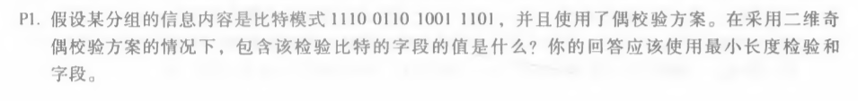

# homework11

​											*马克*

#### 计算机网络（自顶向下）中文第七版第六章课后练习（电子版p349起，纸质版p331起）

###### 1，p1

1110 1

0110 0

1001 0

1101 1

1100 0  

最后一行和一列分别校验值

###### 2，p5

r=4
$$
R = remainder(D*2^r / G) = (1010101010)_2 * 2^{(5-1)} / 10011 = (0100)_2
$$
