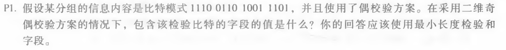
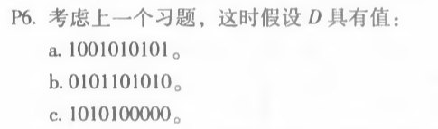

# 网络及分布式计算第十一次作业

计算机学院-刁可 -2017302580031

1. P1

   

   1 1 1 0 1 
   0 1 1 0 0 
   1 0 0 1 0 
   1 1 0 1 1 
   1 1 0 0 0 

2. P5.P6

   

   R = 10101010100000/10011 = 0100

   将10011分为1010101010 0000，可以得到1011011100，剩余R=0100

   

   a.得到1000110000，剩余R=0000。

   b.得到0101010101，剩余R=1111.

   c.得到1011010111，剩余R=1001.