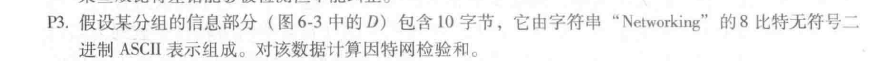
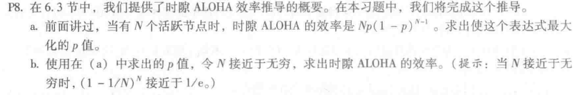
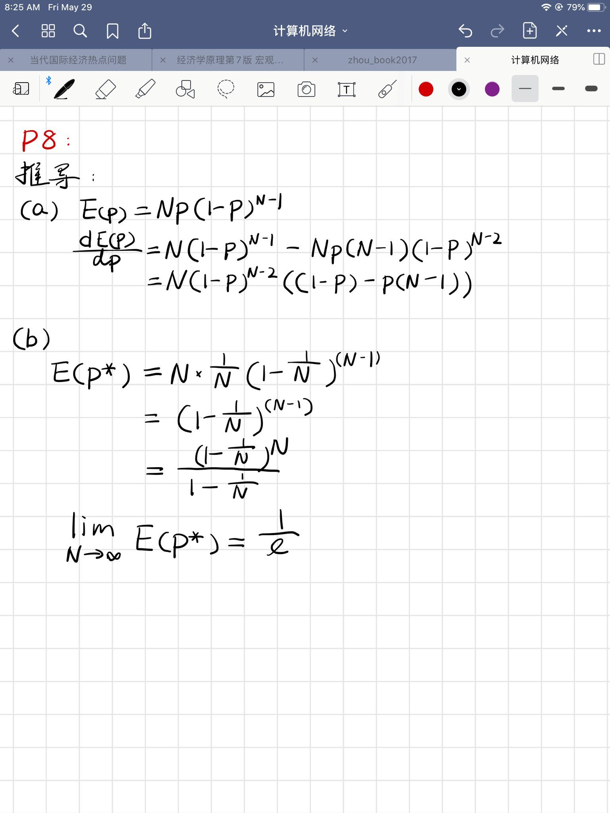
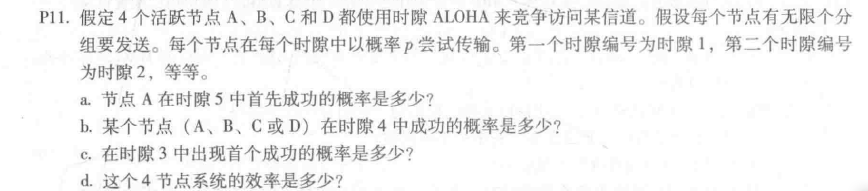
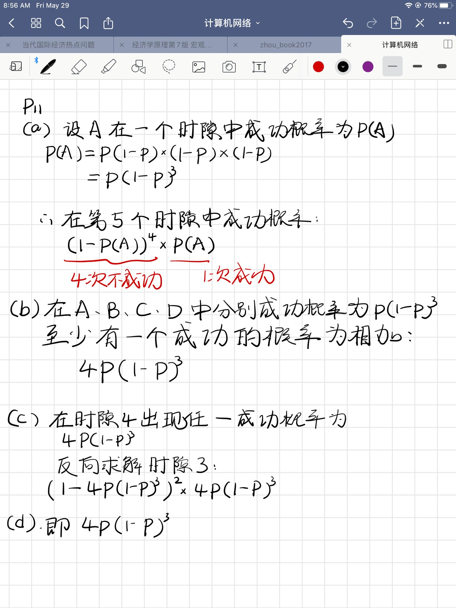

# 第次作业

Author：陈俊杰

StuNo:  2017302580109

选取第六章——链路层的部分习题：

> + P3
>
>  01001100 01101001 
>
> 01101110 01101011 
>
> ——————————
>
> 10111010 11010100 
>
> 00100000 01001100 
>
> ——————————
>
> 11011011 00100000 
>
> 01100001 01111001
>
> ——————————
>
> 00111100 10011010
>
> 01100101 01110010 
>
> ——————————
>
>  10100010 00001100 

> + P8：
>
> 
>
> 证明过程如下：
>
> 

> + P11
>
> 
>
> 

