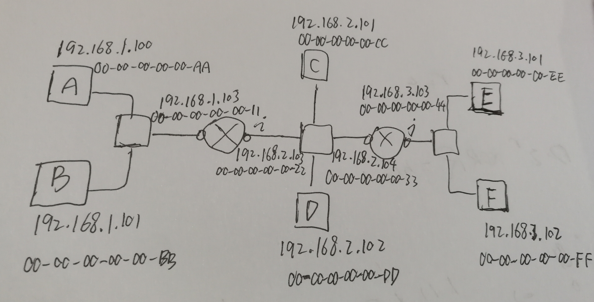

## HomeWork11

学号：2017302580218

姓名：陈炳生

---

### P8

答：

- a）$E(p)=NP(1-p)^{N-1}$ ，对该函数求导

  $E'(p)=N(1-p)^{N-1}-Np(N-1)(1-p)^{N-2}=N(1-p)^{N-2}((1-p)-p(N-1))=N(1-p)^{N-2}(1-PN)$

  令该等式等于0，由于概率p满足 0 < p < 1，故解得 p的极值为$\frac{1}{N}$,即$p^{*}=\frac{1}{N}$

- b）将 $p^{*}=\frac{1}{N}$ 带入原方程得

  $E(p^\ast )=N\frac{1}{N}(1-\frac{1}{N})^{N-1}=(1-\frac{1}{N})^{N-1}=\frac{(1-\frac{1}{N})^N}{1-\frac{1}{N}}$

  $\lim_{N \to \infty }(1-\frac{1}{N})=1$

  $\lim_{N \to \infty }(1-\frac{1}{N})^N=\frac{1}{e}$

  因此

  $\lim_{N \to \infty }E(p^\ast )=\frac{1}{e}$

### P14

答：

- a）只要不使用 IP地址的广播地址，可以根据子网的IP地址形式随意分配IP地址给图中的10个接口。其中6个是主机的接口，4个是路由器的接口。
- b）对于 a 中的每个接口，都需要一个适配器，也就都需要 MAC地址，该地址是唯一的，不能重复，含48个比特。

a、b分配后的结果如下图所示：

- c）
  1. 主机E先查路由转发表确定数据包先传给接口 192.168.3.103
  2. 主机 E查自己的 ARP表，找到通往目的地路径上的第一跳路由器的IP地址对应的 MAC地址，即路由器 j 右边接口 192.168.3.103对应的 MAC地址 00-00-00-00-00-44
  3. E把数据包封装成帧（含目的地 192.168.1.101），发给1中找到的 MAC地址的接口
  4. 路由器j 在 192.168.3.103的接口收到数据报后，查自己的路由表，需要将数据包转发到 192.168.2.104接口
  5. 路由器j的 192.168.2.104查自己的 ARP表，找到 路径上192.168.2.103的MAC地址，封装成帧发过去
  6. 路由器i收到数据报后，转到192.168.1.103接口，查自己的ARP表，找到目的 IP地址192.168.1.101对应的MAC地址为 00-00-00-00-00-BB，并封装成链路层帧发送到 B
- d）主机E确定要发送的接口的 IP地址为192.168.3.103后，由于 ARP表为空无法直接确认该IP地址对应的MAC地址，故需要用MAC广播地址向所属子网发送ARP查询包。路由器j的接口收到后会响应这次查询，从而新表项加入主机E的ARP表，通过它确认MAC地址为00-00-00-00-00-44，从而把数据包封装成帧发送过去。剩下的步骤与 c相同。

