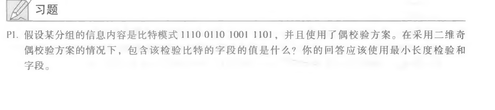
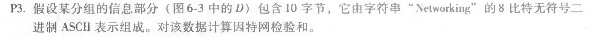

#### 第一题：

​			1	1	1	0	1
​			0	1	1	0	0
​			1	0	0	1	0
​			1	1	0	1	1
​			1	1	0	0	0

#### 第三题：

​	01001100 01101001
​	+
​	01101110 01101011=

​	10111010 11010100
​	+
​	00100000 01001100=

​	11011011 00100000
​	+
​	01100001 01111001=

​	00111100 10011010 (溢出)
​	+
​	01100101 01110010=

​	10100010 00001100

​	取反，
​	01011101 11110011
