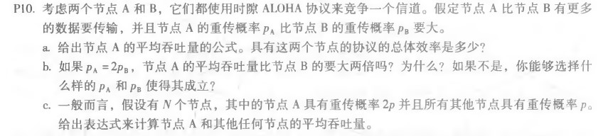
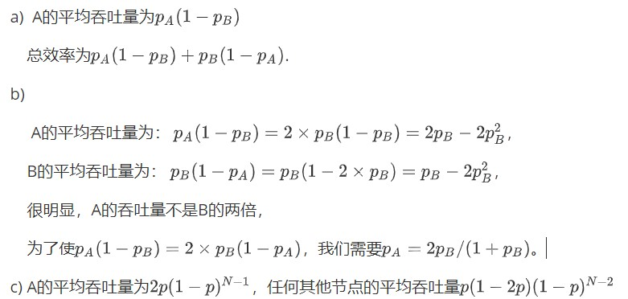

# 网络及分布式作业（十一）

[toc]

## 习题

### P3


二进制ASCII码为：

+ N: 0100 1110 

+ e: 0110 0101

+ t: 0111 0100

+ w: 0111 0111

+ o: 0110 1111

+ r: 0111 0010

+ k: 0110 1011

+ i: 0110 1001

+ n: 0110 1110

+ g: 0110 0111

  ```
  +  0100111001100101
  =  0100111001100101
  +  0111010001110111
  =  1100001011011100
  +  0110111101110010
  =  0011001001001111
  +  0110101101101001
  =  1001110110111000
  +  0110111001100111
  =  0000110000100000
  ```

  和的补码为 1111 0011 1101 1111


### P10






#### P10 Latex原文：

a)  A的平均吞吐量为$p_A(1-p_B)$

​	总效率为$p_A(1-p_B)+p_B(1-p_A)$.

b)

 	A的平均吞吐量为： $p_A(1-p_B)=2\times p_B(1-p_B)=2p_B-2p_B^2$，

​	B的平均吞吐量为： $p_B(1-p_A)=p_B(1-2\times p_B)=p_B-2p_B^2$，

​	很明显，A的吞吐量不是B的两倍，

​	为了使$p_A(1-p_B)=2\times p_B(1-p_A)$，我们需要$p_A=2p_B/(1+p_B)$。

c) A的平均吞吐量为$2p(1-p)^{N-1}$，任何其他节点的平均吞吐量$p(1-2p)(1-p)^{N-2}$

