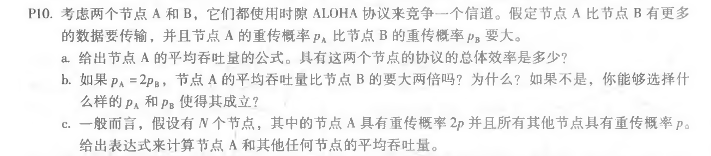

## Homework_11

**Author：**

姓名： 王泽生

学号：2017302580268

第六章习题：**P5、P10**

注：查看公式正确形式，请使用 **Chrome** 浏览器并下载使用 **MathJax Plugin for Github** 插件

### P5

**解答：**

由 6.2.3 节，循环冗余检测有：
$$
R = remainder \frac {D * 2^r} {G}
$$
用 1010101010 0000  / 10011 ，得到商为 1011011100，余数为 0100，故 R 的值为 0100。

### P10

**解答：**

a ）

节点 A 的平均吞吐量公式为：$p_A(1-p_B)$

具有这两个节点的协议的总体效率是：$p_A(1-p_B) + p_B(1-p_A)$

b ）

如果 $p_A = 2p_B$

节点 A 的平均吞吐量公式为：$p_A(1-p_B) = 2p_B(1-p_B)$

节点 B 的平均吞吐量公式为：$p_B(1-p_A) = p_B(1-2p_B)$

故节点 A 的平均吞吐量并不是比节点 B 的要大两倍

如果要使节点 A 的平均吞吐量比节点 B 的要大两倍

则有：$p_A(1-p_B) = 2p_B(1-p_A) $

解得：$p_A = \frac {2p_B} {1+p_B}$

c ）

节点 A 的平均吞吐量：$2p(1-p)^{N-1}$

其他任何节点的平均吞吐量：$p(1-p)^{N-2}(1-2p)$

