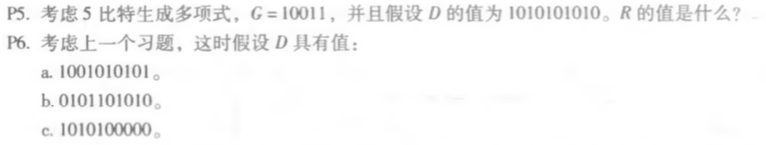
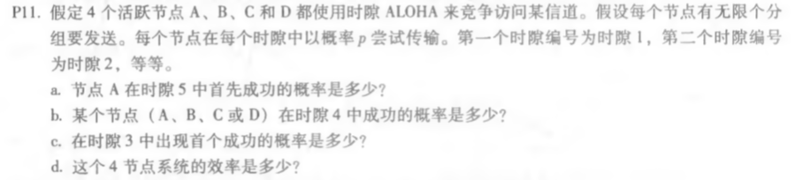

## 课后题两道

### P5、6

、

* 1010101010 0000 / 10011 = 1011011100......0100   R = 0100
* 1001010101 0000 / 10011 = 1000110000......0000   R = 0000
* 0101101010 0000 / 10011 =   101010101......0111   R = 1111
* 1010100000 0000 / 10011 = 1011010111......1001   R = 1001

### P11

a. A在时隙5成功概率是 p(1-p)3,在前4个不成功的概率是 (1-p(1-p)3)4;

​	A在时隙5第一次成功的概率是(1-p(1-p)3)4 ·p(1-p)3

b. 概率是 4p(1-p)3

c. 概率是 (1-4p(1-p)3)2 · 4p(1-p)3

d. 系统的效率,即每个时隙成功的概率为  4p(1-p)3

