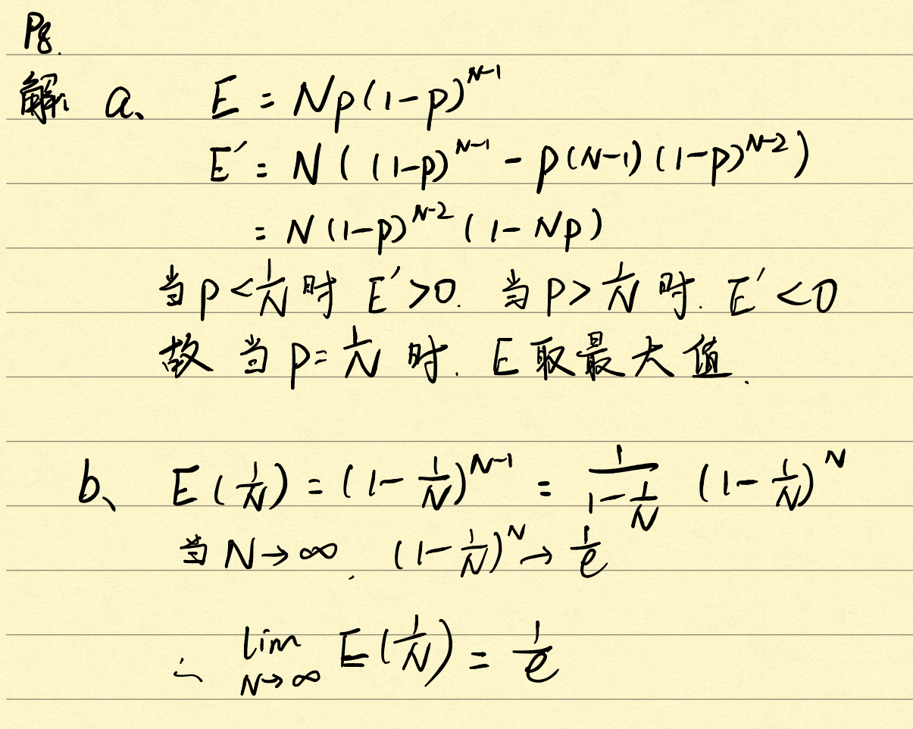

## 课后习题

p8

p15

a. 主机E不会请求路由器R1，因为E会检查F的ip地址，发现他们在同一个子网内，不会请求R1

source ip：E' ip

source mac：E' mac

dest ip：F's ip

dest mac: F's mac

b. 不会，因为E和B不在同一局域网内，不会查询B的MAC

source ip：E's ip

source mac：E's mac

dest ip：F's ip

dest mac: R1's left interface mac

c. S1收到报文会将该广播这个查询报文

R1会收到ARP请求消息，但不会向子网3广播

B不会返回A的查询报文，因为可以从A的请求报文中得到A的地址

S1会把B的地址插入到交换表中