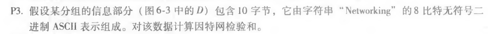

## P3
                
Networking的ASCII码（16进制）分别为4E 65 74 77 6F 72 6B 69 6E 67 
相加得到的校验和（2进制）为0000 1100 0010 0000 
补码（2进制）为1111 0011 1101 1111 
## P5
    
R=remainder(D·2r/G) 
即R=remainder(1010101010·24/10011) 
=remainder(10101010100000/10011) 
=0110

 

 
刘涛 2017302580292 2020.05.28
