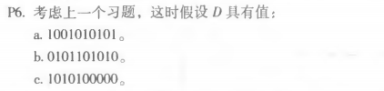

# 第十一次作业
## 刘洋 2017302580294
P5: 
1010101010 0000/10011得到商为1011011100，余数为0100，所以R为0100。 

P6: 
a、1001010101 0000/10011得到商为1000110000，余数为0000，所以R为0000。 
b、0101101010 0000/10011得到商为0101010101，余数为1111，所以R为1111。 
c、1010100000 0000/10011得到商为1011010111，余数为1001，所以R为1001。 