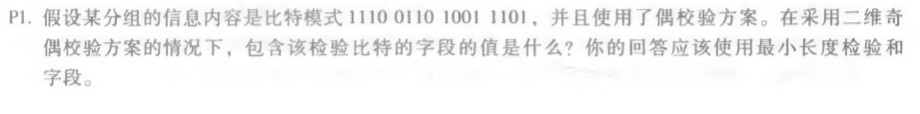
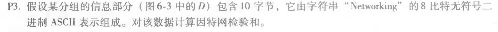

# 第十一次作业
## 第六章课后选2题
### p1

#### 答：包含该检验比特的字段的值是：
```
1110 1
0110 0
1001 0
1101 1
1100 0
```
其中最后一行和最后一列为检验比特

### p3

#### 答：
```
	01001100 01101001
+	01101110 01101011
——————————————————————
	10111010 11010100
+	00100000 01001100
——————————————————————
	11011011 00100000
+	01100001 01111001
——————————————————————
	00111100 10011010 (溢出）
+	01100101  01110010
——————————————————————
	10100010 00001100
～
——————————————————————
	01011101 11110011
```
